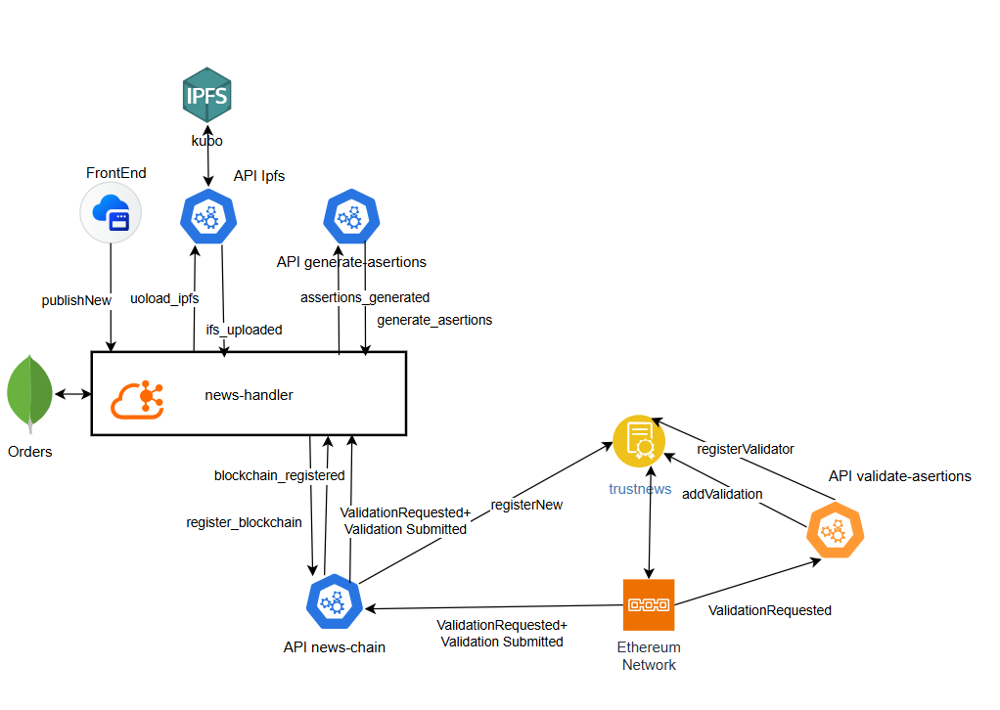
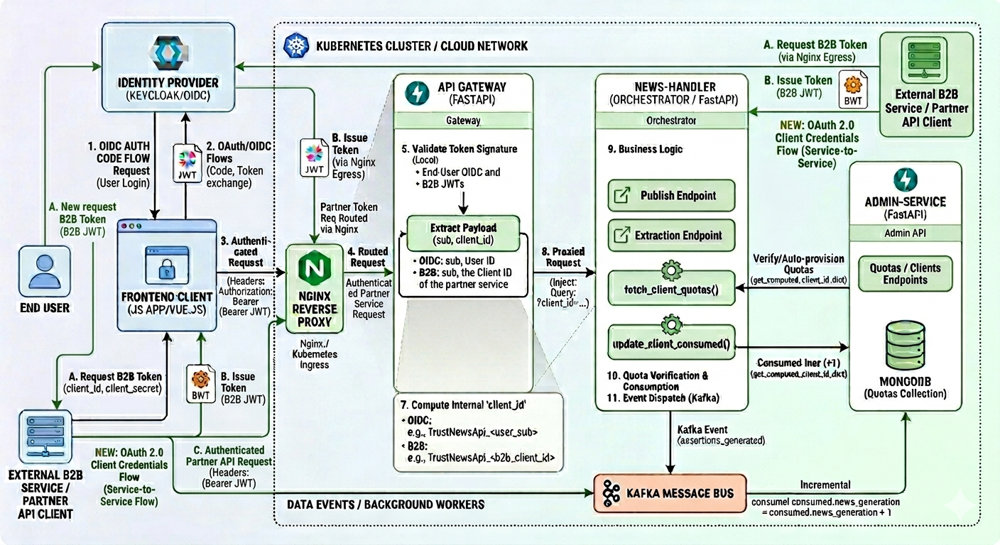

# 📰 TrustNews

> **Automated news verification using AI, IPFS and Ethereum**
> Proof of Concept (Academic / Research Project)


---

## 🔍 What is TrustNews?

**TrustNews** is a **Proof of Concept** for a system that automatically verifies news content by:

* Breaking news into **atomic, objective assertions**
* Validating each assertion using **AI-based validators**
* Persisting the full validation process **immutably on Ethereum**
* Storing documents in a **distributed way using IPFS**

The entire verification pipeline is **fully automated and unattended**, from publication to final validation.

---

## ✨ Why does this matter?

Most fact-checking solutions are:

* Manual or semi-automated
* Centralized
* Not auditable end-to-end

TrustNews explores a different approach:

* ✅ Assertions instead of full-text validation
* ✅ Multiple automated validators
* ✅ Tamper-proof validation history
* ✅ Full traceability (Order → IPFS → Blockchain)

---

## 🧠 Core Ideas

1. **Atomic Assertions**
   News is decomposed into small, verifiable statements.

2. **Unattended Validation**
   AI validators automatically verify assertions without human intervention.

3. **Immutable Traceability**
   Every step is recorded either in IPFS or Ethereum.

---

## 🏗️ Architecture (High Level)




**Key traits**:

* Domain-oriented microservices
* Asynchronous messaging (Kafka)
* Pluggable AI validators
* Private Ethereum network (PoA)

---

## 🔒 Security 




**Key points**:

* IAM: OIDC Auth for Frontend and OAuth 2.0 (Client Credentials) via Nginx for B2B Partners.
* Gateway: Token validation and internal ID generation by merging sub and client_id claims.
* Proxy: Secure request forwarding to the Orchestrator with identity injection via Query Parameters.
* Quotas: Real-time balance verification via Admin API with proactive blocking (429 Error).
* Events: Post-processing consumption increment and event dispatching to the Kafka architecture.

---

## 🧩 Main Components

| Component             | Responsibility                 |
| --------------------- | ------------------------------ |
| `news-handler`        | End-to-end orchestration       |
| `generate-assertions` | AI-based assertion extraction  |
| `validate-assertions` | Automated assertion validation |
| `news-chain`          | Blockchain access layer        |
| `ipfs-fastapi`        | Document storage abstraction   |
| `TrustNews.sol`       | Immutable system state         |
| `web_classic`         | User interaction & monitoring  |

---

## 🚀 Quick Start

### Prerequisites

* Docker >= 24
* Docker Compose >= 2
* Kubernettes
* 8GB RAM recommended

### Clone & Run

```bash
git clone https://github.com/<your-user>/trustnews.git
cd trustnews
docker compose up --build
```

For further info see docs folder.

* installation.md helps you to setup and run the project.
* installation_blockchain.md guides you to set up a configure private geth POA network.
* scripts_blockchain.md to deploy and test TrustNews contract.

After startup, services will be available locally (frontend, APIs, blockchain, IPFS).

> ⏳ First startup may take a few minutes (Ethereum + Kafka initialization)

---

## 📂 Project Structure (main folders) & files

```text
.
├── api  
     ├── gateway/                         (API gateway)
     ├── news-handler/                    (API and Orchestator validation end to end)
     ├── news-chain/                      (API Smart Contract Abstraction)
     ├── generate-assertions/             (API for generate assertions) 
     ├── validate-assertions/             (API for validate assertions)
     ├── common/                          (Common modules)
     ├── mongo/                           (mongo DB Configuration)
     ├── ipfs/                            (API for validate assertions)
     ├── kafka/                           (Kafka Configuration)
     ├── test/                            (Test Units)
├── blockchain/                           (Configuration files for Geth POA private Network)
├── docs/                                 (Doc files)
├── scripts/                              (scripts for build and start/stop containers)
├── smart-contracts/
     ├── contracts/                       (smart contract folder)
     ├── scripts/                         (scripts for deploy and test smart contract)
     ├── hardhat.config.js                (hardhat config)
├── volumes/                              (persistent data folder accross contaniners)
├── web_classic/                          (frontend folder)
└── README.md                             (this file)
```

---

## 🔐 Configuration & Secrets

* `.env.example` provided
* Each developer must create its own `.env`
* **Never commit real secrets**

AI providers and blockchain accounts are configured via environment variables.

---

## ✅ Integrity Checks

The system includes **automatic consistency checks** across:

* MongoDB orders
* IPFS documents
* Ethereum posts, assertions and validations

Ensuring the system is **auditable and tamper-resistant**.

---

## 🛣️ Roadmap
* [X] Secure and authenticate plattform
* [X] Migrate requests and responses to Validation from Kafka to Blockchain Events
* [ ] Support to Hyperledger Besu or Fabric
* [X] Integrate UI with IDP and custom chains for user
* [ ] Validator reputation system
* [ ] Performance and cost analysis
* [ ] API Control

---

## 🤝 Contributing

This is an academic PoC, but contributions are welcome:

1. Fork the repository
2. Create a feature branch
3. Commit your changes
4. Open a Pull Request

---

## 📄 License

Academic / research use only.

---

## 👤 Author

Developed as a **Master Thesis – Proof of Concept**.

---
