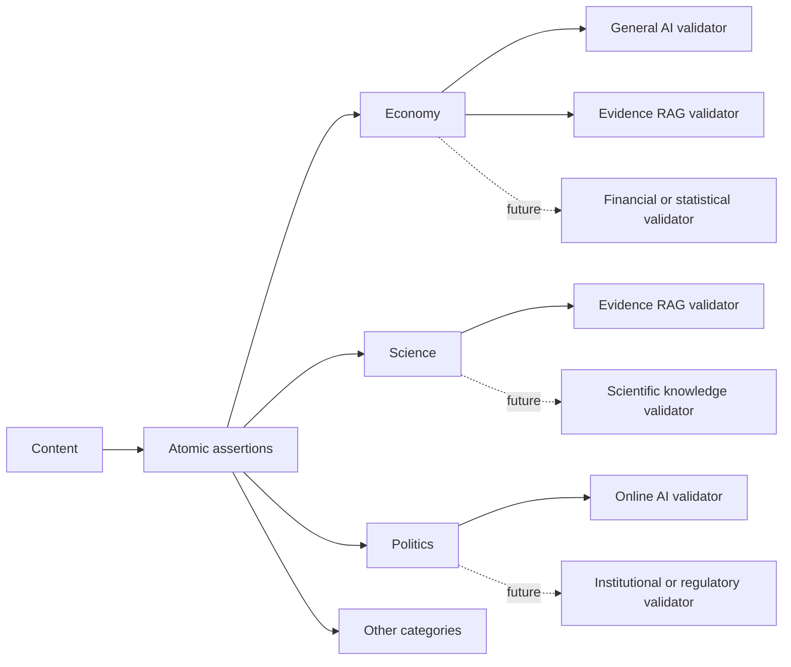
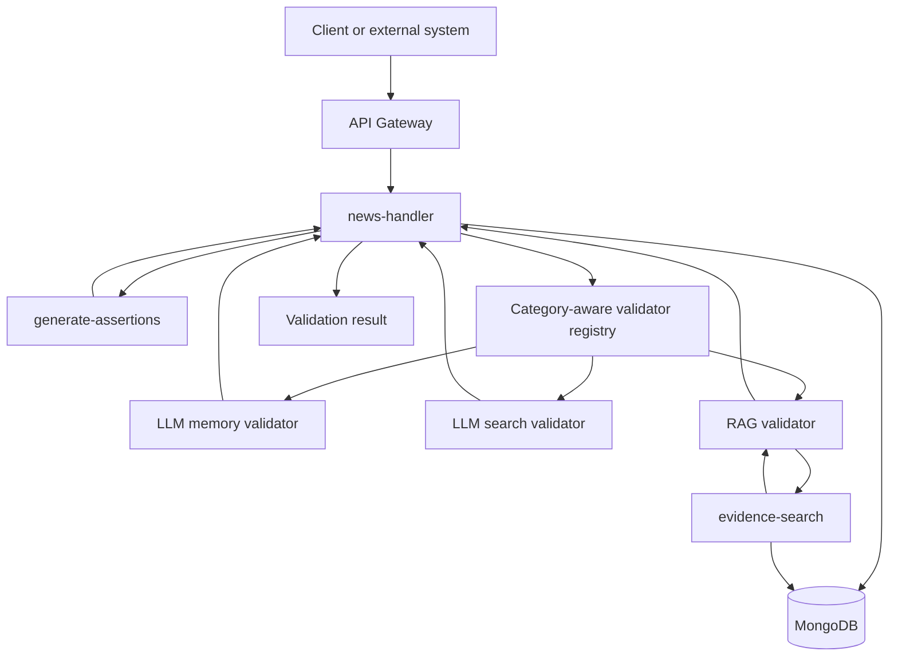
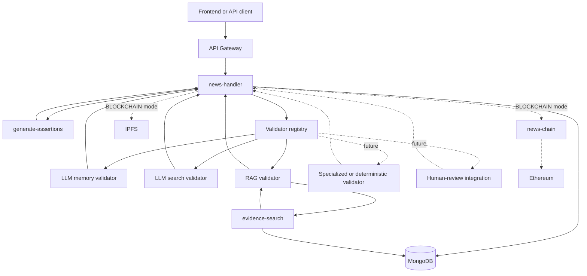

# Assermetry

Evidence-backed claim verification infrastructure for factual content.

Assermetry decomposes content into atomic factual claims, routes each claim to
compatible validators, collects supporting or contradicting evidence, and
produces traceable validation results that can be consumed by people or other
systems.

The project originated as a Master's Thesis focused on automated news
verification and has evolved into a post-TFM prototype exploring a broader
problem:

> **How can people and software verify factual claims using the most appropriate
> available sources of knowledge, rather than relying on a single
> general-purpose AI model?**

Assermetry is currently a research and product-validation prototype. It is not
yet a production fact-checking service, and its automated results should not be
interpreted as authoritative truth.


---

## What Problem Is Assermetry Exploring?

General-purpose LLMs can already search the web and attempt to fact-check a
statement. Simply adding another AI model to the same workflow is therefore a
weak proposition on its own.

Assermetry explores a different model:

```text
Content
   ↓
Atomic factual claims
   ↓
Category for routing and context for retrieval
   ↓
Compatible validators
   ↓
Evidence / knowledge
   ↓
Independent validation results
   ↓
Aggregated and traceable result
```

The key idea is that not every validator should validate every claim. A
validator should contribute where it has useful knowledge or evidence and
where it declares appropriate category coverage.

A generic AI validator may search public information on the internet, while a
future domain-specific validator could validate the same claim against:

- An organization's private knowledge base.
- An official statistical dataset.
- A regulatory corpus.
- A curated scientific repository.
- An authoritative API.
- Deterministic business rules.
- A human expert workflow.

This is the architectural motivation behind Assermetry's category-aware
validator model.

---

## Core Principle: Validators Should Validate What They Know

Assertions in Assermetry have a strict `categoryId`. Validators declare the
categories they support through `VALIDATOR_CATEGORIES`. When an assertion needs
validation, Assermetry selects active validators compatible with that category.

Categories are therefore more than classification metadata:

> **They are routing boundaries between claims and validators that declare
> different areas of competence.**

Conceptually:


```mermaid
flowchart LR
    A[Content] --> B[Atomic assertions]

    B --> C1[Economy]
    B --> C2[Science]
    B --> C3[Politics]
    B --> C4[Other categories]

    C1 --> V1[General AI validator]
    C1 --> V2[Evidence RAG validator]
    C1 -. future .-> V3[Financial or statistical validator]

    C2 --> V4[Evidence RAG validator]
    C2 -. future .-> V5[Scientific knowledge validator]

    C3 --> V6[Online AI validator]
    C3 -. future .-> V7[Institutional or regulatory validator]
```

The long-term goal is not necessarily to create every validator inside
Assermetry. Organizations could operate validators backed by knowledge that
they already own or trust.

Category coverage is currently declared by each validator; it is not proof of
expertise or authority. The present categories are also broad. A mature model
may need subcategories, jurisdictions, temporal scope, covered entities,
knowledge provenance and independent evaluation of validator competence.

### Current Reality

This architecture is only partially implemented today.

| Type | Current status | Knowledge source |
|---|---|---|
| `LLM_MEMORY_VALIDATION` | Implemented | Internal LLM knowledge |
| `LLM_SEARCH_VALIDATION` | Implemented | LLM and provider online search |
| `RAG_EVIDENCE_VALIDATION` | Implemented | Retrieved external evidence |
| `DETERMINISTIC_VALIDATION` | Modeled, not automated | Future rules, databases or APIs |
| `HUMAN` | Modeled, not automated | Future human-review workflow |

Assermetry does not currently include organization-specific validators backed
by private knowledge bases. Building and evaluating them would likely require
domain partners with suitable datasets, such as universities, public
institutions, consortia or other organizations.

This remains an architectural direction, not a prerequisite for the current
product-validation phase. The near-term platform can be evaluated using AI and
RAG validators while the value of specialized validators is explored
independently.

---

## Why Atomic Claims?

Assermetry does not attempt to classify an entire document as simply true or
false. Instead, it extracts individual factual assertions.

For example:

```text
"The company increased revenue by 15% in 2025."

"The event took place in Madrid."

"The regulation entered into force on 1 January 2026."
```

These claims may require completely different evidence. Atomic assertions make
it possible to:

- Search for evidence more precisely.
- Assign categories independently.
- Route claims to different validators.
- Express insufficient evidence instead of forcing a binary conclusion.
- Compare validators.
- Retain provenance for each conclusion.
- Eventually involve specialized or deterministic knowledge sources.

Although Assermetry originated in news verification, the core research problem
is claim verification rather than judging an article as a single unit.

---

## Evidence-Backed Validation

A validation is more useful when its conclusion can be inspected. Assermetry
supports RAG-based evidence retrieval through the `evidence-search` service.

Evidence retrieval can use:

- Assertion text and generated search hints.
- Entities, locations and temporal context.
- Preferred domains and category-specific domain profiles.
- Official-source prioritization.
- Provider search capabilities.
- MongoDB-backed caching and normalization.

This allows a validator to return not only a result, but also the sources and
evidence used to reach it.

The current internal protocol uses:

```text
TRUE
FALSE
UNKNOWN
```

`UNKNOWN` is a first-class result. A validator should be able to abstain when
the available evidence is insufficient rather than fabricate certainty.

---

## Validation Is Not the Same as Truth

Assermetry is designed to gather and structure evidence and validation signals.
It does not assume that:

- An LLM is authoritative.
- Multiple LLMs necessarily represent independent knowledge.
- A web result is automatically reliable.
- Blockchain proves that a claim is true.
- An automated majority vote represents ground truth.

The platform separates several concerns:

```text
What is being claimed?
        ↓
What evidence can be found?
        ↓
Which validators declare relevant coverage?
        ↓
What does each validator conclude?
        ↓
How should those signals be combined?
        ↓
Can the resulting process be inspected later?
```

This distinction is central to the project.

---

## Validator Architecture

A validator is an independently configured validation worker. Each validator
has:

- An identity.
- A validator type.
- Supported categories.
- A status.
- Provider and model configuration where applicable.
- An optional operational reputation value.

Current automated workers consume assertion-validation requests and return
individual results. In `LIGHT` mode this occurs asynchronously through Kafka.
In `BLOCKCHAIN` mode, requests and results can additionally participate in the
IPFS and Ethereum workflow.

The backend currently supports a reputation value in its validator cache and
uses `1.0` when none is provided. This is an aggregation input, not a completed
or calibrated reputation system.

### Current Validator Types

| Type | Automatic | Default weight | Behavior |
|---|---:|---:|---|
| `LLM_MEMORY_VALIDATION` | Yes | `0.25` | Uses internal LLM knowledge and reasoning without external evidence search |
| `LLM_SEARCH_VALIDATION` | Yes | `0.50` | Uses online search provided by a compatible model or provider |
| `RAG_EVIDENCE_VALIDATION` | Yes | `0.80` | Retrieves evidence through `evidence-search` before asking the LLM to assess the assertion |
| `DETERMINISTIC_VALIDATION` | No | `1.00` | Reserved for rules, databases, official APIs or other programmatic checks |
| `HUMAN` | No | `0.10` | Represents a future manual-review workflow |

The weights are implementation defaults, not calibrated probabilities or proof
that one validator type is factually superior. See the
[validator architecture summary](docs/architecture/validator-summary.md) for
the detailed algorithms and configuration.

### Validation Aggregation

Assermetry can receive multiple validation results for the same assertion. The
current backend uses validator-type weights and operational reputation when
aggregating them.

Conceptually:

```text
validator result
      ×
validator type weight
      ×
validator reputation
      ↓
weighted validation signal
```

The resulting aggregation is an implementation mechanism, not a statistical
proof of truth. It must be evaluated against external ground truth before its
scores can be interpreted as calibrated factual confidence.

---

## Product Direction

The current product hypothesis is not:

> An AI that tells users whether a news article is true or false.

The hypothesis being explored is closer to:

> **A verification engine that extracts factual claims, finds relevant
> evidence, routes claims to appropriate validators and returns reviewable
> results with provenance.**

Potential integration scenarios include:

- Factual quality assurance for AI-generated content.
- Editorial and content-production workflows.
- Internal corporate information workflows.
- RAG and AI systems that need an additional verification stage.
- Fact-checking and research workflows.
- CMS integrations.
- OEM or white-label verification engines.
- Specialized environments where organizations contribute their own
  validators.

These are product hypotheses under evaluation, not claims of existing
commercial adoption.

---

## Operating Modes

Assermetry separates the verification engine from the optional auditability
layer.

| Mode | Description | Intended fit |
|---|---|---|
| `LIGHT` | Centralized validation using backend services, Kafka and MongoDB | Default mode for API, internal and product integrations |
| `BLOCKCHAIN` | Adds IPFS and Ethereum-backed auditability | Workflows requiring tamper-resistant historical references |

### LIGHT Mode

`LIGHT` is the simpler mode for most integrations. Validator selection and
requests are orchestrated through the backend and Kafka, and operational state,
evidence and results are stored in MongoDB.


```mermaid
flowchart TD
    A[Client or external system] --> B[API Gateway]
    B --> C[news-handler]

    C --> D[generate-assertions]
    D --> C

    C --> R[Category-aware validator registry]
    R --> V1[LLM memory validator]
    R --> V2[LLM search validator]
    R --> V3[RAG validator]

    V3 --> E[evidence-search]
    E --> V3

    V1 --> C
    V2 --> C
    V3 --> C

    C --> G[(MongoDB)]
    E --> G
    C --> H[Validation result]
```

LIGHT validation results do not require blockchain or IPFS. The current local
bootstrap may still use blockchain-backed validator registration, so follow
the deployment runbook for the profiles required by the present
implementation.

### Optional Auditable Mode

`BLOCKCHAIN` extends the same validation model with IPFS and a private Ethereum
network. It can provide tamper-resistant references showing:

- What was submitted.
- Which validators were requested.
- What results were returned.
- When those events occurred.

Blockchain provides integrity and historical auditability. It does not prove
that a validator's conclusion was factually correct. It is therefore treated
as an optional trust layer rather than the core value proposition of
Assermetry.

---

## Current Capabilities

### Verification

- Atomic assertion extraction from content.
- Strict assertion category identities.
- Category-aware validator selection.
- Multiple validator workers.
- LLM memory validation.
- LLM online-search validation when supported by the provider and model.
- RAG evidence validation.
- Weighted validator aggregation.
- `TRUE`, `FALSE` and `UNKNOWN` results.
- Operational reputation field with a default value; a mature reputation
  system is not yet implemented.

### Evidence

- Dedicated `evidence-search` microservice.
- Search-query generation.
- Temporal, geographical and entity context.
- MongoDB-backed preferred-domain profiles.
- Official-source prioritization strategies.
- Evidence normalization and caching.
- Provider-independent internal evidence contracts.

### Platform and Access

- Secure API Gateway.
- OIDC frontend authentication through Keycloak.
- OAuth 2.0 Client Credentials for controlled B2B access.
- Client-scoped order access through the Gateway.
- Client quotas and quota-consumption accounting.
- Admin API for clients, quotas and operational configuration.
- Kafka-based asynchronous orchestration.

### Infrastructure

- Kubernetes and Skaffold deployment profiles.
- Local Kind deployment.
- Controlled Hetzner/k3s environment.
- Cloudflare perimeter and strict origin TLS.
- Temporary general mTLS and permanent administrative mTLS.
- WAF, rate limiting and non-public route blocking.
- Loki/Grafana observability.
- GitLab CI manual deployment workflow.

### Auditability

- Optional IPFS persistence.
- Optional private Ethereum network.
- Smart-contract validation lifecycle.
- On-chain category registry.
- Validation-event traceability.

---

## Architecture


```mermaid
flowchart TD
    A[Frontend or API client] --> B[API Gateway]
    B --> C[news-handler]

    C --> D[generate-assertions]
    D --> C
    C --> DB[(MongoDB)]

    C --> VR[Validator registry]
    VR --> V1[LLM memory validator]
    VR --> V2[LLM search validator]
    VR --> V3[RAG validator]
    VR -. future .-> V4[Specialized or deterministic validator]
    VR -. future .-> V5[Human-review integration]

    V3 --> E[evidence-search]
    E --> V3
    E --> DB

    V1 --> C
    V2 --> C
    V3 --> C
    V4 -.-> C
    V5 -.-> C

    C -. BLOCKCHAIN mode .-> IPFS[IPFS]
    C -. BLOCKCHAIN mode .-> NC[news-chain]
    NC -.-> ETH[Ethereum]
```

Main architectural traits:

- Domain-oriented microservices under `api/`.
- Kafka as the asynchronous event backbone.
- MongoDB for operational state, quotas, validator cache, evidence
  configuration and caching.
- Category-aware validator selection.
- Dedicated evidence retrieval service.
- Optional IPFS and Ethereum integration.
- Keycloak-based identity.
- Kubernetes and Skaffold deployment profiles.

Additional architecture documents:

- [TrustNews detailed architecture](docs/architecture/TrustNews_detailed.md)
- [Kafka messaging and use cases](docs/architecture/kafka-messaging-and-use-cases.md)
- [Validator architecture](docs/architecture/validator-summary.md)

---

## Main Components

| Component | Responsibility |
|---|---|
| `api/gateway` | Authenticated API entrypoint |
| `api/admin` | Clients, quotas and administrative operations |
| `api/news-handler` | Main workflow orchestration |
| `api/generate-asertions` | Atomic assertion extraction |
| `api/evidence-search` | Evidence retrieval, domain routing and cache |
| `api/validate-asertions` | Validator workers |
| `api/news-chain` | Blockchain integration layer |
| `api/ipfs` | IPFS abstraction |
| `api/common` | Shared models, categories, validator registry and scoring |
| `smart-contracts` | Ethereum smart contracts and scripts |
| `web_classic` | Current frontend |
| `k8s` | Kubernetes manifests and Kustomize overlays |
| `scripts/k8s` | Deployment and bootstrap helpers |

> The repository retains the historical spelling `asertions` in several paths
> and service names.

---

## Evidence Search

The `evidence-search` service exposes:

```http
POST /search/evidence
```

Evidence configuration is stored in MongoDB using collections including:

```text
evidence_domain_profiles
evidence_normalization_configs
evidence_search_cache
```

Preferred-domain behavior is controlled through:

```env
EVIDENCE_SEARCH_USE_PREFERRED_DOMAINS
```

Supported modes:

| Mode | Behavior |
|---|---|
| `NONE` | Use the generated or fallback query without preferred domains |
| `LOCAL` | Resolve preferred domains using local MongoDB profiles |
| `EXT_OFFICIAL_FIRST` | Ask the provider to prioritize official sources |
| `EXT_ONLY_OFFICIAL` | Restrict retrieval to official sources where supported |

Preferred-domain profiles are an initial step toward domain-aware validation.
They should not be confused with a validator owning a private knowledge base:
today they influence where evidence is retrieved from rather than providing an
independent domain-specific knowledge system.

The server bootstrap script loads the default evidence profiles and
normalization metadata:

```bash
scripts/k8s/init-mongodb-server.sh --dry-run
scripts/k8s/init-mongodb-server.sh
```

---

## Current Product-Validation Priorities

The current roadmap prioritizes external and product validation over additional
infrastructure expansion.

### 1. External Evaluation

Build a representative benchmark of factual assertions with independently
established expected results. Measure accuracy, coverage, `UNKNOWN` behavior,
evidence quality, source authority, false positives and negatives,
repeatability, latency and cost.

### 2. Baseline Comparison

Compare Assermetry with simpler alternatives, including general-purpose LLMs
with web search. The project creates meaningful product value only if its
structured validation approach provides measurable advantages for a relevant
workflow.

### 3. Human Review

Introduce a minimal workflow allowing a professional reviewer to accept,
reject or correct a result; mark evidence as insufficient; add or replace
evidence; and record a final human decision.

### 4. Design-Partner Validation

Evaluate Assermetry against real workflows and documents. The main questions
are whether it improves verification quality, reduces investigation time,
provides useful evidence trails, earns repeated use and solves a problem for
which an organization is willing to pay.

### 5. Specialized Validators

Explore organization-specific, deterministic or knowledge-base-backed
validators when suitable partners and datasets become available. This remains
an important architectural direction, but it is not required to validate the
current product hypothesis.

---

## Version Status

The latest closed version is
[`v0.0.12 - Perimeter closure and administrative access`](docs/releases/v0.0.12.md).
The current version is `v0.0.13`, focused on functional stabilization and a
repeatable private demo.

Versioned documentation:

- [Current version record](docs/version.md)
- [Published release summaries](docs/releases.md)
- [Future roadmap](docs/next_releases.md)
- [Known issues](docs/issues.md)

Planned progression:

| Version | Status | Main objective |
|---|---|---|
| `v0.0.12` | Closed | Cloudflare perimeter, controlled access and administrative protection |
| `v0.0.13` | Current | Functional stabilization and repeatable private demo |
| `v0.0.14` | Planned | Closed beta by invitation |
| `v0.0.15` | Planned | Design-partner pilot with explicit success criteria |
| `v0.0.16` | Planned | Production hardening, recovery and operational readiness |
| `v0.9.0` | Planned | Release Candidate and formal GO/NO-GO decision |
| `v1.0.0` | Planned | Controlled production after technical and product acceptance |

Version numbers are not product success criteria by themselves. External
evidence of usefulness should increasingly drive the roadmap.

---

## Deployment

Skaffold profiles currently defined in `skaffold.yaml`:

| Layer | Local profile | Server profile |
|---|---|---|
| Namespaces/setup | `setup` or local namespace script | `setup` |
| Web entrypoint | `traefik` | `traefik-prod` |
| Blockchain | `blockchain` | `blockchain-prod` |
| Infrastructure | `infra`, `infra-basic` | `infra-prod` |
| APIs and frontend | `apis-frontend` | `apis-frontend-prod` |

Primary deployment documentation:

- [Common Kubernetes procedures](docs/deploy/k8s-common.md)
- [Local Skaffold deployment](docs/deploy/skaffold-local.md)
- [Server/Hetzner deployment](docs/deploy/skaffold-server.md)
- [GitLab, GitHub and release workflow](docs/deploy/gitlab-github-release-workflow.md)

The previous Kubernetes notes are archived and non-operational; see
[the archive warning](docs/deploy/old/README.md).

---

## Local Quick Start

Prerequisites:

- Docker
- Kubernetes local cluster
- Kind
- Skaffold v4
- kubectl
- Node.js/npm for smart-contract scripts
- Python 3.10+

Clone:

```bash
git clone https://github.com/cforcadell/trust-news.git
cd trust-news
```

Create local `.env` files from their examples before running Skaffold. Real
secrets must never be committed.

Typical local flow:

```bash
cd ./scripts/k8s
./create-namespaces.sh

cd ../..
./skaffold dev -p blockchain --namespace blockchain
./skaffold dev -p infra
./skaffold dev -p apis-frontend
```

Main local URLs:

| Service | URL |
|---|---|
| Frontend | `https://localhost:7443/gui/` |
| Keycloak Admin | `https://localhost:7443/auth/admin/master/console/` |
| Admin API | `http://localhost:8400/docs` |
| Gateway | `https://localhost:7443/backend/docs` |
| Evidence Search | `http://localhost:8074/docs` |
| News Handler | `http://localhost:8072/docs` |
| News Chain | `http://localhost:8073/docs` |
| Mongo Express | `http://localhost:8081` |
| Kafdrop | `http://localhost:9000` |
| Grafana | `http://localhost:3000` |

See [skaffold-local.md](docs/deploy/skaffold-local.md) for the full local
runbook.

---

## Server Deployment and Release Flow

Current server workflow:

1. Work in branch `postTFM`.
2. Commit changes locally.
3. Push to GitLab with `git push gitlab postTFM`.
4. Run a manual GitLab pipeline on `postTFM`.
5. Use `PROFILE=apis-frontend-prod` for normal API/frontend deployments.
6. Validate the deployment in Hetzner.
7. Open a PR/MR from `postTFM` to `main` in GitHub and GitLab.
8. Create the release from `main`.

The controlled server entrypoint is `https://assermetry.com`. Cloudflare
redirects the exact root path to `/gui/` and publishes only `/gui`, `/backend`
and `/auth`; internal services,
databases, Kafka, IPFS, RPC and observability panels remain private. While the
temporary general mTLS rule is active, an authorized client certificate is
required before application authentication is evaluated.

Infrastructure changes use their dedicated `traefik-prod`, `infra-prod` or
`blockchain-prod` profile. Do not combine profiles in one diagnostic window.

Server secrets are created outside the repository from private `.env` files.
The required Kubernetes secrets and variables are documented in the
[server deployment runbook](docs/deploy/skaffold-server.md).

---

## Project Structure

```text
.
|-- api/                    microservices and shared backend code
|-- blockchain/             private Ethereum network support
|-- docs/                   architecture, deployment, tests and product documentation
|-- k8s/                    Kubernetes manifests and Kustomize overlays
|-- keycloak/               Keycloak customization
|-- scripts/                deployment and maintenance helpers
|-- smart-contracts/        Solidity contracts, Hardhat config and scripts
|-- web_classic/            current frontend
|-- skaffold.yaml           local and server Skaffold profiles
|-- .gitlab-ci.yml          GitLab CI pipeline
`-- README.md
```

---

## Tests and Diagnostics

Available documentation:

- [Test notes](docs/tests/tests.md)
- [Stats notes](docs/tests/stats.md)

Useful static checks for focused changes:

```bash
python3 -m py_compile <python-file>
node --check <javascript-file>
```

For deployment issues, start with the relevant runbook in `docs/deploy/` and
then inspect live pods and logs with `kubectl`.

---

## Security Notes

- Do not commit real `.env` files or Kubernetes secrets.
- Production/server secrets are created outside the repository.
- GitLab CI receives sensitive values through protected and masked variables.
- Keycloak handles OIDC authentication for frontend users.
- B2B/API access uses OAuth 2.0 Client Credentials and is explicitly
  provisioned; there is no public self-registration.
- Client-derived identifiers scope order access through the Gateway, but
  external tenant-isolation tests remain part of the planned closed beta.
- `assermetry.com` is proxied by Cloudflare with strict origin TLS; the Hetzner
  origin accepts application HTTPS only from verified Cloudflare networks.
- A temporary general mTLS rule protects non-administrative routes through
  `v0.0.13`. Its controlled removal is planned for `v0.0.14`.
- The frontend is namespaced under `/gui/`; the controlled `v0.0.14` edge
  cutover adds exact root redirects and a default-deny path allowlist.
- Keycloak administrative routes retain permanent mTLS and still require
  Keycloak authentication after the certificate check.
- The maintenance lock can block the complete hostname independently of OIDC,
  JWT and certificate validity.
- Protected Gateway routes require JWT validation after mTLS, and API
  documentation is not published in the server environment.
- Cloudflare WAF rules, rate limiting and explicit route and method
  restrictions remain active at the edge.

---

## Current Limitations

Assermetry remains a prototype under product validation.

Important limitations include:

- Current automated validators are all AI-based.
- Organization-specific knowledge-base validators have not been implemented.
- Deterministic validators are modeled but not automated.
- Human validation is modeled but lacks a complete review workflow.
- Declared category coverage does not demonstrate validator competence.
- Current categories are broad and may not be sufficient for specialized
  routing.
- Validation quality has not been established against a sufficiently large,
  independent benchmark.
- Validator aggregation weights must not be interpreted as calibrated
  probabilities.
- Multiple AI validators may share correlated model or evidence errors.
- Evidence quality depends on retrieval providers and source availability.
- Official-source policies may be ranking hints rather than guarantees,
  depending on the provider.
- Validator reputation is not yet a mature trust mechanism.
- Production hardening remains in progress.
- The Hetzner deployment uses a single Kubernetes node and must not be
  presented as highly available.
- `BLOCKCHAIN` mode has substantially more operational complexity than
  `LIGHT`.
- Blockchain guarantees integrity of recorded information, not factual
  correctness.
- Access remains controlled while external evaluation is prepared.
- [`ISSUE-001`](docs/issues.md#issue-001---carrera-de-inicializacion-en-la-cache-de-validadores-light)
  is mitigated, but its LIGHT validator-cache initialization race remains to be
  resolved in `v0.0.13`.
- Memory headroom and rollout scheduling remain under observation, and the
  non-blocking `DNSConfigForming` warning is still registered.

Known implementation issues are tracked in [docs/issues.md](docs/issues.md).

---

## Project Status and Commercial Use

Assermetry started as an academic Master's Thesis project. The current
repository represents its post-TFM evolution into an experimental
claim-verification platform.

The project is exploring whether the technical architecture can demonstrate
measurable value in real professional workflows. There is currently no claim
of product-market fit or production readiness.

Before commercial use, licensing, intellectual-property, provider terms, data
handling and liability requirements must be formally resolved.

---

## License

Academic / research use only.

The repository does not currently include a standalone license file, so it
should not be assumed to grant commercial-use rights.

---

## Author

Developed originally as a Master's Thesis proof of concept and subsequently
extended as the independent Assermetry post-TFM project.
