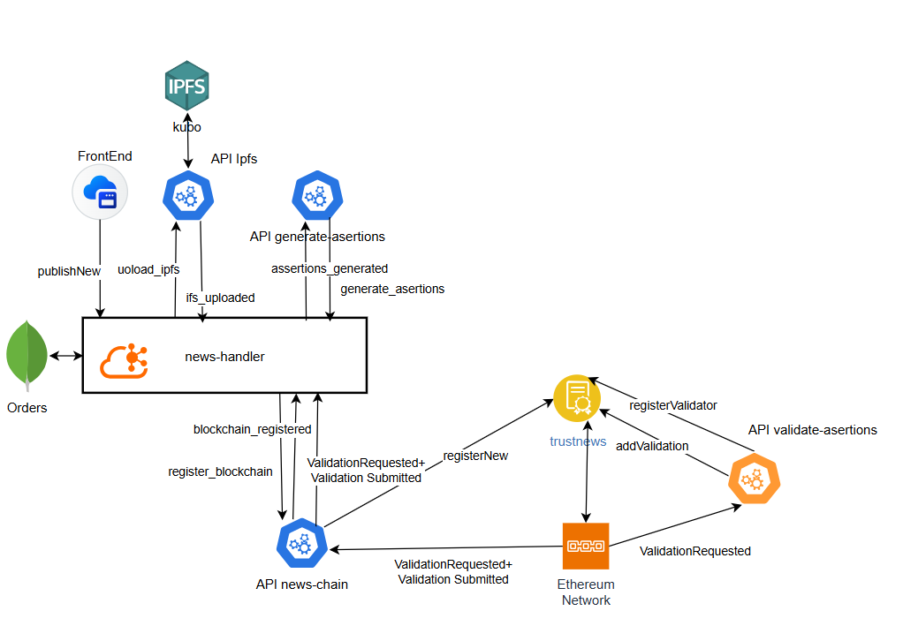
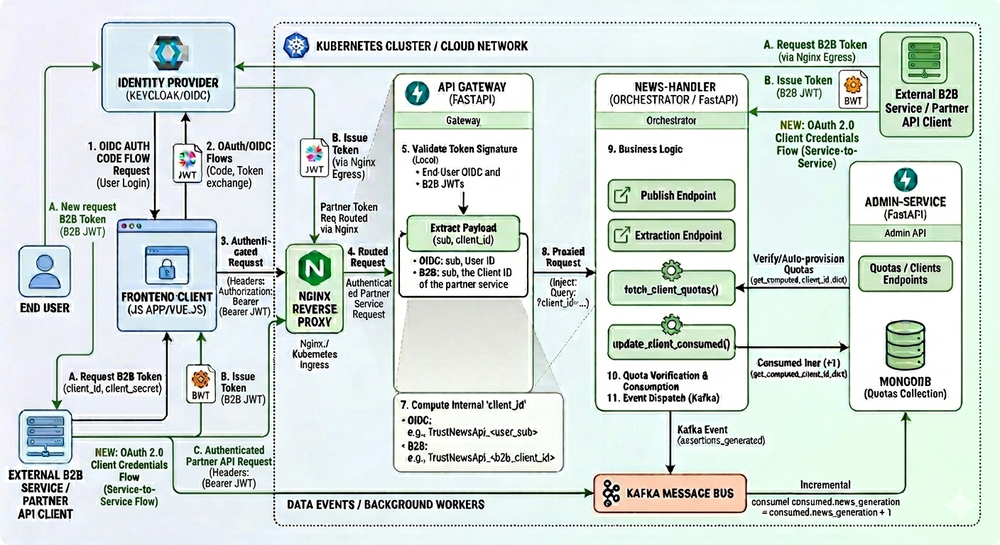

# 📰 TrustNews

> **Automated news verification using AI, IPFS and Ethereum**  
> Proof of Concept (Academic / Research Project)


---

## 🔍 What is TrustNews?

**TrustNews** is a **Proof of Concept** for a system that automatically verifies news content by:

* Breaking news into **atomic, objective assertions**
* Validating each assertion using **AI-based validators** or dedicated validators with his own database Knowledge
* Enriching RAG validators with **evidence-search** and preferred official sources
* Persisting the full validation process **immutably on Ethereum**
* Storing documents in a **distributed way using IPFS**

The verification pipeline is designed to run automatically from publication to final validation, while keeping the process auditable end to end.

---

## ✨ Why does this matter?

Most fact-checking solutions are:

* Manual or semi-automated
* Centralized
* Not auditable end-to-end

TrustNews explores a different approach:

* ✅ Assertions instead of full-text validation
* ✅ Multiple automated validators
* ✅ Evidence-backed RAG validation
* ✅ Tamper-proof validation history
* ✅ Full traceability (Order → IPFS → Blockchain)

---

## 🧠 Core Ideas

1. **Atomic Assertions**  
   News is decomposed into small, verifiable statements.

2. **Unattended Validation**  
   AI validators automatically verify assertions without human intervention.

3. **Evidence Search**  
   RAG validators can retrieve and cache supporting sources, prioritizing configurable official domains.

4. **Immutable Traceability**  
   Every step is recorded either in MongoDB, IPFS, Kafka events, or Ethereum.

---

## 🏗️ Architecture (High Level)



**Key traits**:

* Domain-oriented microservices
* Asynchronous messaging (Kafka)
* Pluggable AI validators (memory, online search, RAG evidence)
* MongoDB-backed order, quota, validator and evidence data
* Private Ethereum network (PoA)
* Kubernetes/Skaffold local and production overlays

---

## 🔒 Security



**Key points**:

* IAM: OIDC Auth for Frontend and OAuth 2.0 (Client Credentials) via Nginx for B2B Partners.
* Gateway: Token validation and internal ID generation by merging sub and client_id claims.
* Proxy: Secure request forwarding to the Orchestrator with identity injection via Query Parameters.
* Quotas: Real-time balance verification via Admin API with proactive blocking (429 Error).
* Events: Post-processing consumption increment and event dispatching to the Kafka architecture.
* Secrets: Local overlays use ignored `.env` files; production secrets are created outside the repository.

---

## 🧩 Main Components

| Component | Responsibility |
| --- | --- |
| `gateway` | Authenticated API entrypoint |
| `admin` | Quotas, clients, model recommendations and evidence-search config CRUD |
| `news-handler` | End-to-end orchestration and Kafka event handling |
| `generate-assertions` | AI-based assertion extraction |
| `validate-assertions` | Automated assertion validation workers |
| `evidence-search` | Tavily-backed evidence retrieval with MongoDB cache |
| `news-chain` | Blockchain access layer |
| `ipfs-fastapi` | Document storage abstraction |
| `mongodb` | Orders, quotas, validator cache, evidence and config data |
| `mongo-express` | Local MongoDB inspection UI |
| `keycloak` | Identity provider |
| `TrustNews.sol` | Immutable system state |
| `web_classic` | User interaction and monitoring |

---

## 🚀 Quick Start

### Prerequisites

* Docker >= 24
* Kubernetes local cluster (Kind is used in the project docs)
* Skaffold v4
* kubectl
* 8GB RAM recommended

### Clone

```bash
git clone https://github.com/<your-user>/trustnews.git
cd trustnews
```

### Local Environment Files

Create local `.env` files from the examples before running Skaffold. Real secrets must not be committed.

Important local files:

```text
k8s/infra/mongodb/overlays/local/mongodb.env
k8s/infra/mongo-express/overlays/local/mongo-express.env
k8s/infra/keycloak/overlays/local/keycloak.env
k8s/apis/generate-asertions/overlays/local/generate-asertions.env
k8s/apis/mongodb-app/overlays/local/mongodb-app.env
k8s/apis/news-chain/overlays/local/news-chain.env
k8s/apis/evidence-search/overlays/local/tavily.env
k8s/apis/validate-asertions/overlays/local/worker-*/worker-*.env
```

MongoDB local examples:

```bash
cp k8s/infra/mongodb/overlays/local/mongodb.env.example \
  k8s/infra/mongodb/overlays/local/mongodb.env
cp k8s/apis/mongodb-app/overlays/local/mongodb-app.env.example \
  k8s/apis/mongodb-app/overlays/local/mongodb-app.env
cp k8s/infra/mongo-express/overlays/local/mongo-express.env.example \
  k8s/infra/mongo-express/overlays/local/mongo-express.env
```

`mongodb.env` creates the MongoDB root/admin user and the application user `app_trust_user`. Runtime services use only `mongodb-app-secret`, whose `MONGO_URI` must authenticate `app_trust_user` against `newsdb` with `readWrite` permissions. Mongo Express keeps using the admin/root secret for database inspection.

Production overlays expect sensitive secrets to be created outside the repository, usually with:

```bash
kubectl create secret generic <secret-name> --from-env-file=<file>.env -n <namespace>
```

### Local Kubernetes Run

The repository is aligned around Skaffold profiles:

```bash
skaffold dev -p setup
skaffold dev -p blockchain
skaffold dev -p infra
skaffold dev -p apis-frontend
```

Main local URLs exposed by Skaffold:

| Service | URL |
| --- | --- |
| Frontend | https://localhost:7443 |
| Keycloak admin console | https://localhost:7443/auth/admin/master/console/ |
| Admin API | http://localhost:8400/docs |
| Gateway | http://localhost:8500/docs |
| Evidence Search | http://localhost:8074/docs |
| Mongo Express | http://localhost:8081 |
| Kafdrop | http://localhost:9000 |
| Grafana | http://localhost:3000 |

> ⏳ First startup may take a few minutes while Ethereum, Kafka, MongoDB, IPFS and Keycloak stabilize.

For detailed commands, see:

* `docs/k8s/skaffold.md` for the current Kubernetes/Skaffold workflow.
* `docs/k8s/kind.md` for Kind setup notes.
* `docs/docker/installation_blockchain.md` for private Geth PoA setup notes.
* `docs/blockchain/scripts_blockchain.md` for smart contract deploy/test scripts.

---

## Evidence Search Configuration

RAG validators call `evidence-search` through the v2 endpoint:

```http
POST /search/evidence
```

The service resolves preferred domains from MongoDB collection:

```text
newsdb.evidence_domain_profiles
```

Search responses are cached separately in:

```text
newsdb.evidence_search_cache
```

The cache key includes normalized assertion text, the v2 search policy and the domain profile version, and expires with `EVIDENCE_SEARCH_CACHE_TTL_SECONDS`.

Domain profiles are contextual: category, subcategory, country, region, city and entity profiles can all contribute preferred domains. To seed or refresh them, use:

```bash
python scripts/k8s/apis/init-evidence-search-domains.py \
  --source /path/to/profiles.yaml \
  --refresh --confirm
```

---

## 📂 Project Structure (main folders)

```text
.
├── api/
│   ├── admin/                  quotas, clients and evidence config
│   ├── common/                 shared models and utilities
│   ├── evidence-search/        RAG evidence search and cache
│   ├── gateway/                API gateway
│   ├── generate-asertions/     assertion generation service
│   ├── ipfs/                   IPFS API abstraction
│   ├── news-chain/             smart contract API abstraction
│   ├── news-handler/           orchestration service
│   ├── tests/                  unit tests
│   └── validate-asertions/     validator workers
├── blockchain/                 Geth PoA network manifests/config
├── docs/                       documentation
├── k8s/                        Kubernetes manifests and Kustomize overlays
├── scripts/                    helper scripts
├── smart-contracts/            Solidity contracts and Hardhat scripts
├── web_classic/                frontend
└── README.md
```

---

## ✅ Integrity Checks

The system includes consistency checks across:

* MongoDB orders
* IPFS documents
* Ethereum posts, assertions and validations
* Kafka validation events

This helps keep the validation process auditable and tamper-resistant.

---

## 🛣️ Roadmap

* [X] Secure and authenticate platform
* [X] Migrate requests and responses to validation from Kafka to blockchain events
* [X] Integrate UI with IDP and custom chains for user
* [X] Evidence-backed RAG validation
* [ ] Support Hyperledger Besu or Fabric
* [ ] Validator reputation system
* [ ] Performance and cost analysis
* [ ] API Control

---

## 🤝 Contributing

This is an academic PoC, but contributions are welcome:

1. Fork the repository
2. Create a feature branch
3. Commit your changes
4. Open a Pull Request

---

## 📄 License

Academic / research use only.

---

## 👤 Author

Developed as a **Master Thesis – Proof of Concept**.
