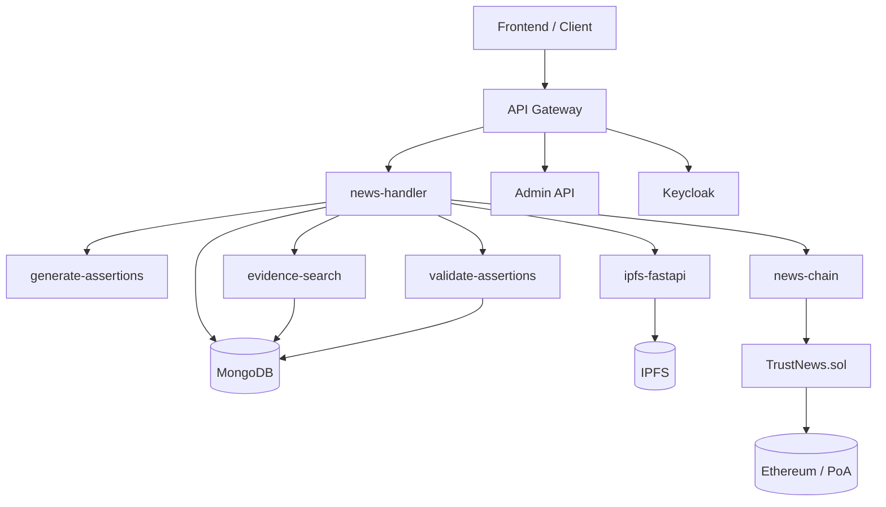

# TrustNews

Automated news verification platform using AI validators, RAG-assisted evidence
search, MongoDB-backed operational state and optional blockchain auditability.

TrustNews started as a Master Thesis proof of concept and is now maintained as a
post-TFM prototype with Kubernetes/Skaffold deployment runbooks for local and
server environments.


---

## Overview

TrustNews decomposes news into atomic assertions, enriches them with optional
RAG evidence search, validates each assertion with AI-based validator workers
and stores the resulting workflow state for traceability.

The platform supports two operating modes:

| Mode | Description | Main use case |
|---|---|---|
| `LIGHT` | Centralized validation with backend services and MongoDB persistence | Internal platforms, CMS integrations, corporate workflows |
| `BLOCKCHAIN` | Auditable validation with IPFS, Ethereum and blockchain events | Traceable validation workflows with tamper-resistant evidence links |

---

## Current Capabilities

- Atomic assertion extraction from news content.
- Assertion schema based on strict `categoryId` identities.
- AI-based unattended validation workers.
- Validator behavior derived from `VALIDATOR_TYPE`.
- RAG-assisted evidence search.
- Preferred-domain evidence strategies backed by MongoDB profiles.
- Evidence normalization metadata and cache in MongoDB.
- OpenRouter/Gemini-compatible assertion and validation flows.
- Secure API Gateway.
- OIDC frontend authentication through Keycloak.
- OAuth 2.0 Client Credentials for B2B access.
- Admin API for clients, quotas and operational configuration.
- Kafka-based asynchronous orchestration.
- Optional IPFS persistence.
- Optional Ethereum smart contract auditability.
- Idempotent MongoDB bootstrap for server deployments.
- Idempotent on-chain category initialization.
- Local and Hetzner-oriented Kubernetes/Skaffold runbooks.
- GitLab CI manual deployment flow from `postTFM`.

---

## Architecture

Main architectural traits:

- Domain-oriented microservices under `api/`.
- Kafka as asynchronous event backbone.
- MongoDB as operational state, quota store, evidence profile store and cache.
- Dedicated `evidence-search` service.
- Optional IPFS and Ethereum integration for blockchain mode.
- Keycloak for user and service authentication.
- Skaffold profiles for local and production-like deployments.


```mermaid
flowchart TD
    A[Frontend / Client] --> B[API Gateway]
    B --> C[news-handler]

    C --> D[generate-assertions]
    C --> E[evidence-search]
    C --> F[validate-assertions]
    C --> G[(MongoDB)]

    E --> G
    F --> G

    C --> H[ipfs-fastapi]
    H --> I[(IPFS)]

    C --> J[news-chain]
    J --> K[TrustNews.sol]
    K --> L[(Ethereum / PoA)]

    B --> M[Admin API]
    B --> N[Keycloak]
```

Additional architecture documents:

- [TrustNews detailed architecture](docs/architecture/TrustNews_detailed.md)
- [Kafka messaging and use cases](docs/architecture/kafka-messaging-and-use-cases.md)
- [Validator summary](docs/architecture/validator-summary.md)

---

## Main Components

| Component | Responsibility |
|---|---|
| `api/gateway` | Authenticated API entrypoint |
| `api/admin` | Clients, quotas and admin operations |
| `api/news-handler` | Main orchestration service |
| `api/generate-asertions` | AI-based assertion extraction |
| `api/evidence-search` | RAG evidence retrieval, domain routing and cache |
| `api/validate-asertions` | Automated validation workers |
| `api/news-chain` | Blockchain access layer |
| `api/ipfs` | IPFS document storage abstraction |
| `api/common` | Shared models, category catalog and utilities |
| `smart-contracts` | Solidity contracts and Hardhat scripts |
| `web_classic` | Frontend |
| `k8s` | Kubernetes manifests and Kustomize overlays |
| `scripts/k8s` | Deployment/bootstrap helpers |

Note: the repository keeps the historical spelling `asertions` in several
paths and service names.

---

## Evidence Search

The `evidence-search` service exposes:

```http
POST /search/evidence
```

It uses MongoDB collections in `newsdb`:

```text
evidence_domain_profiles
evidence_normalization_configs
evidence_search_cache
```

Preferred-domain behavior is controlled by:

```env
EVIDENCE_SEARCH_USE_PREFERRED_DOMAINS
```

Supported modes:

| Mode | Meaning |
|---|---|
| `NONE` | Use the generated or fallback search query without preferred domains |
| `LOCAL` | Use MongoDB domain profiles and pass selected domains to the provider |
| `EXT_OFFICIAL_FIRST` | Ask the provider to prioritize official sources |
| `EXT_ONLY_OFFICIAL` | Ask the provider to restrict to official sources when supported |

The server bootstrap script loads the default evidence profile and normalization
metadata:

```bash
scripts/k8s/init-mongodb-server.sh --dry-run
scripts/k8s/init-mongodb-server.sh
```

---

## Blockchain Mode

In `BLOCKCHAIN` mode:

- Documents can be persisted through IPFS.
- News posts are registered in the Ethereum private network.
- Validation requests are emitted as blockchain events.
- Validator workers submit validation results back to the smart contract.
- Validation documents are linked through IPFS CIDs.
- Categories are initialized on-chain with `smart-contracts/scripts/initCategories.js`.

The local category catalog and smart contract category registry must stay
aligned. If categories are changed, verify the deployed contract before
deploying APIs.

---

## Deployment

Skaffold profiles currently defined in `skaffold.yaml`:

| Layer | Local profile | Server profile |
|---|---|---|
| Namespaces/setup | `setup` or local namespace script | `setup` |
| Blockchain | `blockchain` | `blockchain-prod` |
| Infrastructure | `infra`, `infra-basic` | `infra-prod` |
| APIs and frontend | `apis-frontend` | `apis-frontend-prod` |

Primary deployment documentation:

- [Common Kubernetes procedures](docs/k8s/k8s-common.md)
- [Local Skaffold deployment](docs/k8s/skaffold-local.md)
- [Server/Hetzner deployment](docs/k8s/skaffold-server.md)
- [GitLab, GitHub and release workflow](docs/k8s/gitlab-github-release-workflow.md)

The previous Kubernetes notes are archived in `docs/k8s/old/`.

---

## Local Quick Start

Prerequisites:

- Docker
- Kubernetes local cluster
- Kind
- Skaffold v4
- kubectl
- Node.js/npm for smart-contract scripts
- Python 3.10+

Clone:

```bash
git clone https://github.com/cforcadell/trust-news.git
cd trust-news
```

Create local `.env` files from examples before running Skaffold. Real secrets
must never be committed.

Typical local flow:

```bash
cd ./scripts/k8s
./create-namespaces.sh

cd ../..
./skaffold dev -p blockchain --namespace blockchain
./skaffold dev -p infra
./skaffold dev -p apis-frontend
```

Main local URLs:

| Service | URL |
|---|---|
| Frontend | `https://<traefik-host>` |
| Keycloak Admin | `https://<traefik-host>/auth/admin/master/console/` |
| Admin API | `http://localhost:8400/docs` |
| Gateway | `https://<traefik-host>/backend/docs` |
| Evidence Search | `http://localhost:8074/docs` |
| News Handler | `http://localhost:8072/docs` |
| News Chain | `http://localhost:8073/docs` |
| Mongo Express | `http://localhost:8081` |
| Kafdrop | `http://localhost:9000` |
| Grafana | `http://localhost:3000` |

See [skaffold-local.md](docs/k8s/skaffold-local.md) for the full local runbook.

---

## Server Deployment and Release Flow

Current server workflow:

1. Work in branch `postTFM`.
2. Commit changes locally.
3. Push to GitLab with `git push gitlab postTFM`.
4. Run a manual GitLab pipeline on `postTFM`.
5. Use `PROFILE=apis-frontend-prod` for normal API/frontend deployments.
6. Validate the deployment in Hetzner.
7. Open PR/MR from `postTFM` to `main` in GitHub and GitLab.
8. Create the release from `main`.

The repo has both GitHub and GitLab remotes documented in:

- [GitLab, GitHub and release workflow](docs/k8s/gitlab-github-release-workflow.md)

Server secrets are created outside the repository from private `.env` files.
The required Kubernetes secrets and variables are documented in:

- [Server/Hetzner deployment](docs/k8s/skaffold-server.md)

---

## Project Structure

```text
.
|-- api/                    microservices and shared backend code
|-- blockchain/             geth/private-network support files
|-- docs/                   architecture, deployment, tests and examples
|-- k8s/                    Kubernetes manifests and Kustomize overlays
|-- keycloak/               Keycloak theme/customization files
|-- scripts/                helper scripts for k8s, MongoDB, Docker and network tasks
|-- smart-contracts/        Solidity contracts, Hardhat config and scripts
|-- web_classic/            frontend
|-- skaffold.yaml           local and production Skaffold profiles
|-- .gitlab-ci.yml          GitLab CI build/deploy/bootstrap pipeline
`-- README.md
```

---

## Tests and Diagnostics

Available documentation:

- [Test notes](docs/tests/tests.md)
- [Stats notes](docs/tests/stats.md)

Useful static checks for focused changes:

```bash
python3 -m py_compile <python-file>
node --check <javascript-file>
```

For deployment issues, start with the relevant runbook in `docs/k8s/` and then
inspect live pods/logs with `kubectl`.

---

## Security Notes

- Do not commit real `.env` files or Kubernetes secrets.
- Production/server secrets are created outside the repository.
- The README and k8s docs use placeholders for secret values.
- GitLab CI receives sensitive values through protected/masked variables.
- Keycloak handles OIDC authentication for frontend users.
- B2B/API access uses OAuth 2.0 Client Credentials.

---

## Current Limitations

TrustNews is still a research/prototype platform.

Known limitations:

- AI validators depend on external LLM providers.
- Evidence quality depends on the selected search provider.
- External official-source modes depend on provider support.
- Some providers may treat official-source policies as ranking hints rather than hard filters.
- Validator reputation is planned but not completed.
- Production hardening is still in progress.
- `BLOCKCHAIN` mode has higher operational complexity than `LIGHT` mode.

---

## Roadmap

- [x] Secure authenticated gateway.
- [x] Assertion-based news verification.
- [x] Strict `categoryId` protocol identity.
- [x] AI-based validation engine.
- [x] Evidence-backed RAG validation.
- [x] Preferred-domain evidence search.
- [x] MongoDB-backed evidence domain profiles.
- [x] Evidence search cache.
- [x] LIGHT mode for centralized validation workflows.
- [x] BLOCKCHAIN mode for auditable validation workflows.
- [x] IPFS document storage in blockchain mode.
- [x] Ethereum smart contract registration.
- [x] Blockchain event-based validation.
- [x] Admin and quota management.
- [x] Kubernetes/Skaffold deployment workflow.
- [x] GitLab CI manual deployment flow.
- [ ] Improve evidence ranking and deduplication.
- [ ] Improve provider-specific official-source filtering behavior.
- [ ] Validator reputation system.
- [ ] Full production hardening.
- [ ] Performance and cost analysis.
- [ ] Evaluate Hyperledger Besu or Fabric support.

---

## License

Academic / research use only.

---

## Author

Developed as a Master Thesis proof of concept and later extended in the
post-TFM phase.
